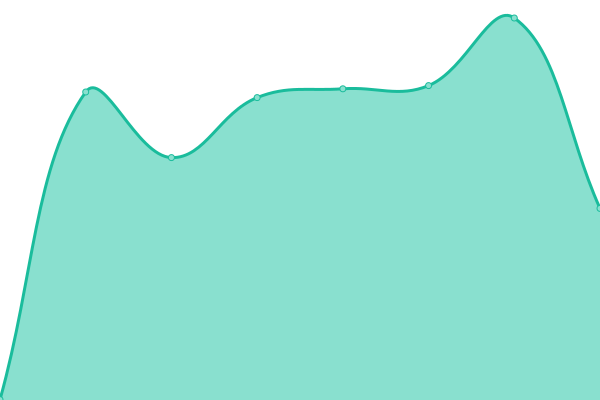

# [📈 Live Status](https://demo.upptime.js.org): <!--live status--> **🟩 All systems operational**

This repository contains the open-source uptime monitor and status page for [Upptime](https://upptime.js.org), powered by [Upptime](https://github.com/upptime/upptime).

With [Upptime](https://upptime.js.org), you can get your own unlimited and free uptime monitor and status page, powered entirely by a GitHub repository. We use [Issues](https://github.com/upptime/upptime/issues) as incident reports, [Actions](https://github.com/upptime/upptime/actions) as uptime monitors, and [Pages](https://demo.upptime.js.org) for the status page.

<!--start: status pages-->
<!-- This summary is generated by Upptime (https://github.com/upptime/upptime) -->
<!-- Do not edit this manually, your changes will be overwritten -->
<!-- prettier-ignore -->
| URL | Status | History | Response Time | Uptime |
| --- | ------ | ------- | ------------- | ------ |
|  [DEGOYA](https://degoya.digital) | 🟩 Up | [degoya.yml](https://github.com/degoya/Upptime/commits/master/history/degoya.yml) | 

 960ms
     
 | 

<a href="https://degoya.upptime.js.org/history/degoya">99.36%</a>
    

|  [Hostflex](https://hostflex.de) | 🟩 Up | [hostflex.yml](https://github.com/degoya/Upptime/commits/master/history/hostflex.yml) | 

 762ms
     
 | 

<a href="https://degoya.upptime.js.org/history/hostflex">100.00%</a>
    

|  [Hostflex ISPC1](https://ispc1.hostflex.de) | 🟩 Up | [hostflex-ispc-1.yml](https://github.com/degoya/Upptime/commits/master/history/hostflex-ispc-1.yml) | 

 552ms
     
 | 

<a href="https://degoya.upptime.js.org/history/hostflex-ispc-1">100.00%</a>
    

|  [Hostflex Web1](https://web1.hostflex.de) | 🟩 Up | [hostflex-web1.yml](https://github.com/degoya/Upptime/commits/master/history/hostflex-web1.yml) | 

 496ms
     
 | 

<a href="https://degoya.upptime.js.org/history/hostflex-web1">100.00%</a>
    

|  [Hostflex Web2](https://web2.hostflex.de) | 🟩 Up | [hostflex-web2.yml](https://github.com/degoya/Upptime/commits/master/history/hostflex-web2.yml) | 

 656ms
     
 | 

<a href="https://degoya.upptime.js.org/history/hostflex-web2">100.00%</a>
    

<!--end: status pages-->

[**Visit our status website →**](https://demo.upptime.js.org)

## 📄 License

- Powered by: [Upptime](https://github.com/upptime/upptime)
- Code: [MIT](./LICENSE) © [Upptime](https://upptime.js.org)
- Data in the `./history` directory: [Open Database License](https://opendatacommons.org/licenses/odbl/1-0/)
